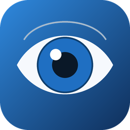
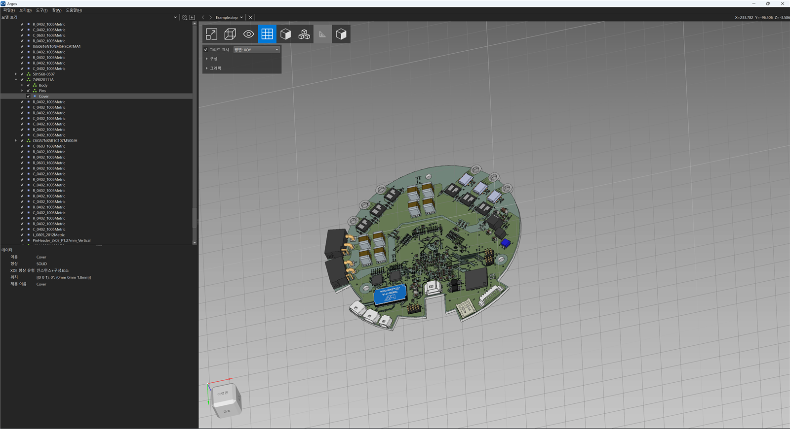
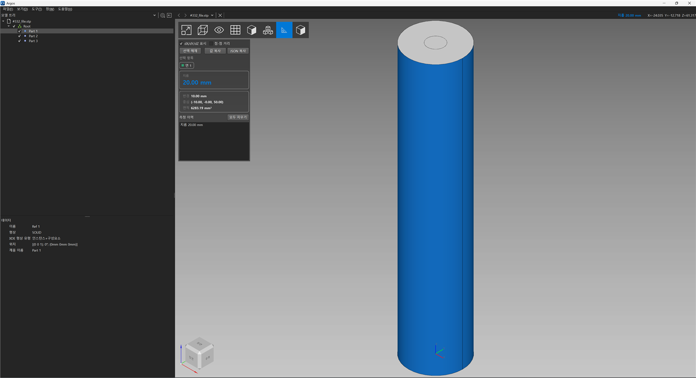
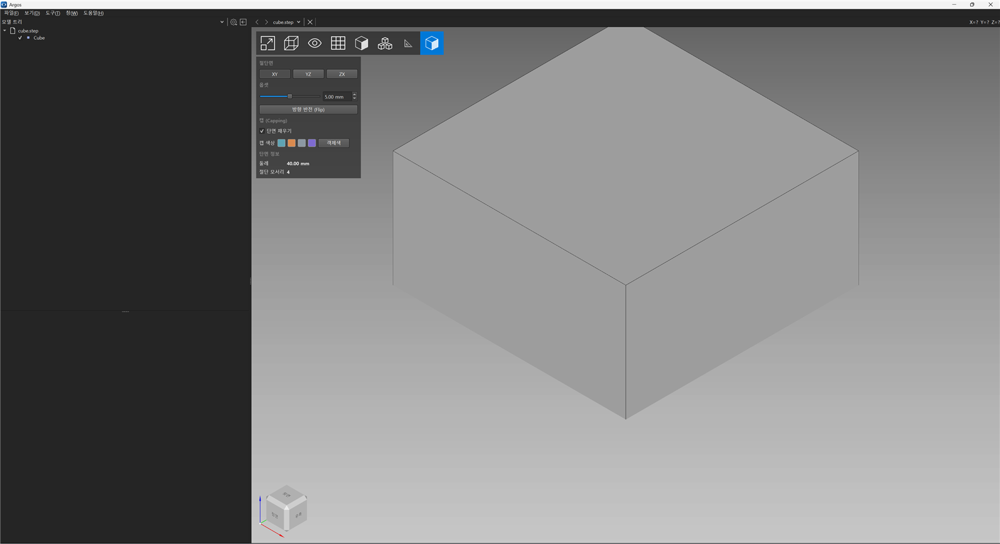

<div align="center">



# Argos

**Windows 네이티브 3D CAD 측정 뷰어** · STEP · IGES · STL

SolidWorks 스타일 **측정**·**단면** 도구와 Qt 비의존 측정 엔진을 갖춘
[Mayo](https://github.com/fougue/mayo) 포크

**[한국어](README.md)** · [English](README.en.md)

</div>

---



## ✨ 주요 기능

Argos는 Mayo의 탄탄한 뷰어 기능은 그대로 두고, 그 위에 **측정 · 단면 · 자동화 엔진 · 한국어 UI**를 더했습니다.

### 📐 SolidWorks 스타일 측정
도구를 켜고 **점·모서리·면을 모드 전환 없이 클릭**하면 측정 종류가 자동 판별됩니다.
형상 위에 **마우스만 올려도(클릭 0번)** 길이·면적·지름이 실시간으로 표시됩니다.

- 선택 항목 색상 칩, **대형 값 카드**, 색깔 ΔX/ΔY/ΔZ 그리드, 보조 정보(반경·중심·둘레…)
- 값 복사 / JSON 복사 / 선택 해제, 측정 이력, 단축키(`M`·`Esc`·`Ctrl+C`)



### ✂️ 단면(Section) 도구
표준 평면(XY / YZ / ZX) 기준으로 자르고, 오프셋 슬라이더·방향 반전·**캡(단면 채우기)**·캡 색상을 지원합니다.
단면 **둘레·절단 모서리**는 Qt 비의존 엔진이 계산합니다.



### ⚙️ `argos_core` — Qt 비의존 엔진 + CLI
측정/단면/로더를 **Qt가 전혀 없는** OpenCASCADE 전용 계층으로 분리했습니다(JSON 반환).
같은 엔진을 GUI · CLI · (향후) MCP가 공유 → AI/자동화가 Argos를 구동할 수 있습니다.

```
argos_core (Qt 없음, OpenCASCADE only)
   ├── Argos GUI (Qt)
   └── argos-cli  → JSON
```

## ⬇️ 다운로드

최신 빌드는 **[Releases](https://github.com/Seobuk/Argos/releases/latest)** 에서 받을 수 있습니다.
`Argos-win64.zip` 의 압축을 풀고 **`Argos.exe`** 를 실행하세요. (Windows 10/11 64비트)

> 비공개 저장소이므로 다운로드에는 저장소 접근 권한이 필요합니다.

## 🖥 명령줄 도구 (`argos-cli`)

헤드리스로 측정·단면을 수행하고 결과를 **JSON으로 표준출력**합니다.

```bash
# 두 꼭짓점 사이 거리 (dX/dY/dZ 포함)
argos-cli measure part.step --vertex 1 --vertex 7

# XY 평면, z = 5 단면
argos-cli section part.step --plane xy --offset 5

# 질량·무게중심·관성텐서 (휴머노이드 링크 동역학용; 밀도 kg/m³)
argos-cli props part.step --density 2700

# URDF <inertial> 블록으로 출력 (로봇 링크에 바로 붙여넣기)
argos-cli props part.step --urdf

# 모델 요약 / 한 번에 요약(치수·질량·지름)
argos-cli info part.step
argos-cli digest part.step --pretty
```

### 📑 STEP 측정 보고서 (PowerPoint 자동 생성)
STEP을 넣으면 폴더를 만들고 **사진·치수 중심의 PowerPoint 보고서**를 자동 생성합니다 —
가로·세로·높이, **여러 각도(등각) 사진**, 각 뷰 이미지에 치수가 그려진 **치수 도면**.
3D 이미지는 `mayo-conv`로 **완전 오프스크린 렌더링**(창이 뜨지 않아 작업 중에도 OK)됩니다.

```powershell
pip install python-pptx pillow
py -3.12 scripts/argos_report.py part.step --out part_report
# 질량·관성·URDF 슬라이드까지: --with-mass
```

예시는 [examples/planetary_gear](examples/planetary_gear) (실제 유성기어 보고서 포함).

> 🤖 **휴머노이드용 질량·관성**: `props`(또는 보고서 `--with-mass`)는 부피·무게중심·
> **관성텐서(COM 기준)**·주관성모멘트를 SI 단위(kg, kg·m²)로 계산해 URDF
> `<inertial>`로 내보냅니다.

## 🔨 빌드 (Windows)

- Visual Studio 2022 빌드 도구(C++) · vcpkg(OpenCASCADE **7.9.0** 고정) · Qt 6

```powershell
powershell -File scripts/argos-build.ps1 -Tests
powershell -File scripts/argos-package.ps1   # dist/Argos-win64.zip 생성
```

결과물: `build/Release/` 의 `mayo.exe`(→ 배포 시 `Argos.exe`), `argos-cli.exe`, `argos_core_test.exe`.

## 📚 문서

- [Argos vs Mayo 차이점](docs/argos-vs-mayo.md) — 기능별 비교(완료/부분/예정)
- [제품 스펙](docs/argos-spec.md)
- [UI 디자인 핸드오프](docs/ui-design/)

## 🙏 오픈소스 고지

Argos는 아래 오픈소스로 만들어졌습니다. 전체 목록·버전·저작권·링크는 **[오픈소스 고지(THIRD-PARTY-NOTICES)](docs/THIRD-PARTY-NOTICES.md)** 를 참고하세요.

| 구성요소 | 라이선스 |
|---|---|
| [Mayo](https://github.com/fougue/mayo) — 포크 원본 | BSD-2-Clause |
| [Qt](https://www.qt.io) 6.8.3 | LGPL-3.0 |
| [Open CASCADE](https://dev.opencascade.org) 7.9.0 | LGPL-2.1 + 예외 |
| [nlohmann/json](https://github.com/nlohmann/json) 3.11.3 | MIT |
| [fmt](https://github.com/fmtlib/fmt) · [Microsoft GSL](https://github.com/microsoft/GSL) · [magic_enum](https://github.com/Neargye/magic_enum) · [KDBindings](https://github.com/KDAB/KDBindings) · [miniply](https://github.com/vilya/miniply) | MIT |
| [fast_float](https://github.com/fastfloat/fast_float) | Apache-2.0 / MIT / BSL-1.0 |
| [Noto Sans KR](https://fonts.google.com/noto/specimen/Noto+Sans+KR) · [Pretendard](https://github.com/orioncactus/pretendard) | SIL OFL 1.1 |

## 📄 라이선스

Argos 자체는 Mayo의 **BSD-2-Clause** 라이선스를 그대로 따릅니다([LICENSE.txt](LICENSE.txt)).
Argos는 [fougue/mayo](https://github.com/fougue/mayo)의 포크입니다.
